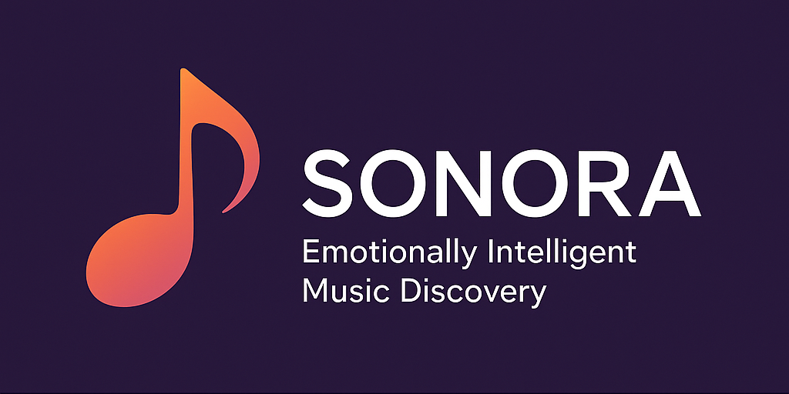

# 🎧 Sonora: Emotionally Intelligent Music Discovery

> *"There’s a song for how you feel. The problem is, it’s buried under 100 million others."*

**Sonora** is a community-driven experiment in emotional music discovery—built for listeners who feel overlooked, for artists who remain undiscovered, and for everyone tired of being fed the same safe algorithmic loops.

What if we could find music the way we feel it—not by genre or release date, but by *mood*, *texture*, and *what’s happening inside us*?

Sonora is our answer. It’s not a product. It’s not a startup. It’s an open-source project fueled by shared curiosity and sound.

---

## 🧠 What Sonora Does

- Creates **living playlists** based on emotional resonance, musical structure, and user-submitted tags.
- Uses a blend of **machine learning**, **audio analysis**, and **community input** to organize music by how it *feels*, not how it sells.
- Surfaces **buried gems**—old, new, obscure, global—based on your emotional context.
- Helps **independent artists** reach the people who are most likely to love their sound.

---

## 💡 What Makes It Different

- 🔖 **Crowd-tagged taxonomy** of emotional states, moods, and musical traits.
- 🧬 Inspired by the **Music Genome Project**, built with modern machine learning.
- 🎶 Designed to **evolve with you**—your listening shapes what Sonora becomes.
- 🕊️ **Not for sale. Not ad-supported. Not for data mining.** Ever.

---

## 🌱 How You Can Contribute

We’re looking for collaborators who care more about music than metrics:

- 🎧 **Listeners & curators** to tag songs by emotional, musical, or lyrical qualities.
- 🧠 **Data scientists & devs** to help with playlist generation, clustering, and ML pipelines.
- 🎨 **Designers & writers** to help communicate the project with clarity and beauty.
- 🎼 **Artists & musicians** who want to help shape a new discovery model.

See [`CONTRIBUTING`](CONTRIBUTING.md) for details.

---

## 📍 Current Phase: Laying the Foundation

- ✅ Initial schema for mood and music tagging
- ✅ Repo launched under AGPLv3 license
- ⏳ Community seeding, playlist engine prototyping
- 🧭 Outreach to indie musicians, open-source devs, and AI ethicists

---

## 📜 License

Sonora is licensed under the **GNU Affero General Public License v3.0**. This means:
- You can use, share, and improve it freely
- If you host it publicly, you must share your changes
- Commercial exploitation without contribution is prohibited

See [`LICENSE`](LICENSE.md) for details.

---

## ✉️ Want to Join or Ask a Question?

Open an issue or start a discussion here in the repo. Or email [putouts-specs8n@icloud.com].

Let’s build something real—and let it sing.
